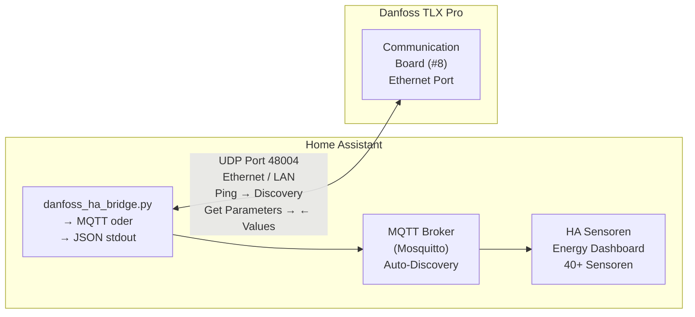

# Danfoss TLX Pro → Home Assistant

[](https://github.com/hacs/integration) [](https://github.com/volschin/Danfoss-TLX-2-HA/releases) [](LICENSE) [](https://github.com/volschin/Danfoss-TLX-2-HA/actions/workflows/test.yml)

Direkte Anbindung des Danfoss TLX Pro Wechselrichters an Home Assistant über das **EtherLynx-Protokoll** (UDP Port 48004) – ohne zusätzliche Hardware wie ESP32 oder RS485-Adapter.

## ✨ Features

- ⚡ **40+ Sensoren** — Leistung, Energie, Spannung, Strom, Betriebsmodus
- 🔌 **Plug & Play** — Automatische Inverter-Erkennung via Discovery
- 🔄 **Konfigurierbares Polling** — 5 bis 3600 Sekunden Abfrageintervall
- 🌙 **Intelligente Offline-Erkennung** — Inverter schaltet nachts ab, morgens automatisch zurück
- 📊 **Energy Dashboard** — Volle Integration mit dem HA Energy Dashboard
- 🛡️ **Validierung beim Setup** — Erkennt frühzeitig wenn der Inverter keine Daten liefert
- 🧩 **2- und 3-String-Modelle** — TLX 6k bis 15k unterstützt

## 📦 Installation

### HACS (empfohlen)

[](https://my.home-assistant.io/redirect/hacs_repository/?owner=volschin&repository=Danfoss-TLX-2-HA&category=integration)

1. HACS in Home Assistant öffnen
2. **Integrations** → drei Punkte oben rechts → **Custom repositories**
3. Repository-URL einfügen: `https://github.com/volschin/Danfoss-TLX-2-HA`
4. Kategorie: **Integration** → **Add**
5. Nach "Danfoss TLX Pro" suchen und **Download** klicken
6. Home Assistant neustarten

### Manuelle Installation

1. Neuestes Release von der [Releases-Seite](https://github.com/volschin/Danfoss-TLX-2-HA/releases) herunterladen
2. Den Ordner `danfoss_tlx` nach `custom_components/danfoss_tlx/` kopieren
3. Home Assistant neustarten

## ⚙️ Einrichtung

1. **Settings** → **Devices & Services** → **Add Integration**
2. Nach **Danfoss TLX Pro** suchen
3. Konfiguration eingeben:
   - **IP-Adresse** des Wechselrichters
   - **Seriennummer** (optional, wird automatisch erkannt)
   - **Anzahl PV-Strings** (2 oder 3)
   - **Abfrageintervall** in Sekunden

Die Integration prüft beim Setup sowohl die Erreichbarkeit als auch das Lesen von Parametern.

## 📊 Verfügbare Sensoren

### ⚡ Echtzeit (alle 15–30 Sekunden)

- Netzleistung gesamt + pro Phase (W)
- PV-Spannung, Strom, Leistung pro String
- Netzspannung pro Phase (V), Netzstrom pro Phase (A)
- Netzfrequenz (Hz), Betriebsmodus

### 🔋 Energie (alle 5 Minuten)

- Gesamtproduktion (kWh, Lifetime)
- Produktion heute, diese Woche, diesen Monat, dieses Jahr
- Netzenergie heute pro Phase, PV-Energie pro String

### 🖥️ System (stündlich)

- Hardware-Typ, Nennleistung, Software-Version, Seriennummer

## 🏗️ Architektur



## 🔌 Protokoll-Details

Das EtherLynx-Protokoll ist die Ethernet-Variante des ComLynx-Protokolls (offizieller Danfoss User Guide):

- **Transport:** UDP, Port 48004
- **Adressierung:** Seriennummer des Inverters
- **Nachrichtentypen:** Ping (0x01), Get/Set Parameter (0x02), Get/Set Text (0x03)
- **Parameter-Zugriff:** Index/Subindex, Module ID 8 (Communication Board)
- **Batch-Abfrage:** Mehrere Parameter pro Request möglich

## 🔧 Legacy: MQTT-Bridge

Für Nutzer die HACS nicht verwenden können, steht eine MQTT-Bridge bereit:

<details>
<summary>MQTT-Bridge Anleitung aufklappen</summary>

### Voraussetzungen

- Python 3.9+ auf dem HA-Host
- `pip install paho-mqtt` (nur für MQTT-Modus)

### Dateien

| Datei | Beschreibung |
|---|---|
| `danfoss_etherlynx.py` | Protokoll-Bibliothek (EtherLynx UDP) |
| `danfoss_ha_bridge.py` | HA-Bridge (MQTT-Daemon oder JSON-Modus) |
| `danfoss_config.yaml` | Konfigurationsdatei |
| `configuration.yaml` | HA Sensor- und Automations-Konfiguration |
| `danfoss_etherlynx.service` | systemd-Service für den MQTT-Daemon |

### Schnellstart

```bash
# Dateien kopieren
mkdir -p /config/scripts
cp danfoss_etherlynx.py danfoss_ha_bridge.py danfoss_config.yaml /config/scripts/

# IP-Adresse in danfoss_config.yaml anpassen
# inverter_ip: "192.168.1.100"

# Schnelltest
python3 /config/scripts/danfoss_etherlynx.py 192.168.1.100 --mode discover

# MQTT-Daemon starten
pip install paho-mqtt
python3 /config/scripts/danfoss_ha_bridge.py --mode mqtt --config /config/scripts/danfoss_config.yaml

# Als systemd-Service installieren
sudo cp danfoss_etherlynx.service /etc/systemd/system/
sudo systemctl daemon-reload
sudo systemctl enable --now danfoss_etherlynx
```

</details>

## 🐛 Troubleshooting

<details>
<summary>Inverter nicht erreichbar</summary>

1. Inverter muss **eingeschaltet** sein (nur bei Tageslicht/Solarproduktion aktiv)
2. Ethernet-Kabel prüfen (Link-LED am Inverter und Switch)
3. IP-Adresse korrekt? Im Router/DHCP prüfen
4. Ping-Test: `ping 192.168.1.100`
5. UDP-Port nicht blockiert: `nc -u 192.168.1.100 48004`

</details>

<details>
<summary>Nachts keine Daten</summary>

Das ist normal! Der TLX Pro schaltet sich nachts ab. Die Integration erkennt dies automatisch und setzt den Status auf "offline". Morgens werden die Daten automatisch wieder aktualisiert.

</details>

<details>
<summary>Seriennummer erkannt, aber keine Parameterdaten</summary>

Wenn Discovery (Ping) funktioniert, aber keine Parameterwerte geliefert werden:

- **Firmware-Unterschiede:** Verschiedene TLX-Pro-Firmwareversionen können leicht abweichende Protokoll-Details haben
- **Gerätetyp:** TLX 6k/8k/10k/12.5k/15k können unterschiedliche Parameter unterstützen
- **Protokoll-Timing:** Manche Inverter brauchen längere Timeouts

**Diagnose-Kommandos:**

```bash
python3 danfoss_etherlynx.py 192.168.1.100 --mode discover
python3 danfoss_etherlynx.py 192.168.1.100 --mode all -v
```

**E2E-Test gegen echten Inverter:**

```bash
INVERTER_IP=192.168.1.100 python -m pytest tests/test_e2e_inverter.py -v -s
```

</details>

<details>
<summary>Falsche Werte</summary>

- Skalierungsfaktoren in `danfoss_etherlynx.py` prüfen
- Manche Parameter sind erst ab bestimmten Firmware-Versionen verfügbar
- String 3 ist nur bei TLX 10k/12.5k/15k vorhanden
- Temperatursensoren zeigen "Nicht verfügbar" wenn kein externer Sensor angeschlossen ist (Sentinel-Wert ≥ 120°C)

</details>

<details>
<summary>MQTT Discovery funktioniert nicht</summary>

1. Mosquitto-Broker installiert und läuft?
2. MQTT-Integration in HA aktiviert?
3. Discovery-Prefix korrekt? (default: `homeassistant`)
4. Logs prüfen: `sudo journalctl -u danfoss_etherlynx -f`

</details>

## ⚖️ Vergleich: EtherLynx vs. RS485/ESP32

| | EtherLynx (diese Lösung) | RS485 + ESP32 |
|---|---|---|
| **Zusätzliche Hardware** | Keine (0 €) | ESP32 + RS485 (~25 €) |
| **Installation** | HACS / Python-Script | Firmware flashen, löten |
| **Wartung** | Minimal | ESP32 kann abstürzen |
| **Parameter pro Request** | N gleichzeitig | Sequentiell |
| **Datenrate** | 100 Mbit Ethernet | 19200 Baud RS485 |
| **Multi-Inverter** | Broadcast möglich | Nur 1:1 |
| **Schreibzugriff** | Ja (Set Parameter) | Nur lesen |

## 📄 Lizenz

MIT License – siehe [LICENSE](LICENSE).

Das EtherLynx-Protokoll ist dokumentiert im offiziellen Danfoss "ComLynx and EtherLynx User Guide".
