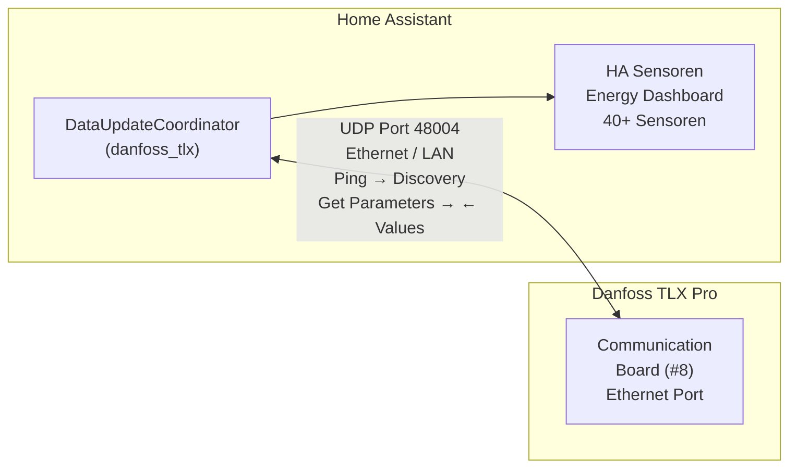

# Danfoss TLX Pro → Home Assistant

[](https://github.com/hacs/integration) [](https://github.com/volschin/Danfoss-TLX-2-HA/releases) [](LICENSE) [](https://www.home-assistant.io/docs/quality_scale/)

[](https://github.com/volschin/Danfoss-TLX-2-HA/actions/workflows/test.yml) [](https://github.com/volschin/Danfoss-TLX-2-HA/actions/workflows/hacs.yml) [](https://github.com/volschin/Danfoss-TLX-2-HA/actions/workflows/hassfest.yml)

Direkte Anbindung des Danfoss TLX Pro Wechselrichters an Home Assistant über das **EtherLynx-Protokoll** (UDP Port 48004) – ohne zusätzliche Hardware wie ESP32 oder RS485-Adapter.

## ✨ Features

- ⚡ **40+ Sensoren** — Leistung, Energie, Spannung, Strom, Betriebsmodus
- 🔌 **Plug & Play** — Automatische Inverter-Erkennung via Discovery
- 🔄 **Konfigurierbares Polling** — 5 bis 3600 Sekunden Abfrageintervall
- 🌙 **Intelligente Offline-Erkennung** — Inverter schaltet nachts ab, morgens automatisch zurück
- 📊 **Energy Dashboard** — Volle Integration mit dem HA Energy Dashboard
- 🛡️ **Validierung beim Setup** — Erkennt frühzeitig wenn der Inverter keine Daten liefert
- 🧩 **2- und 3-String-Modelle** — TLX 6k bis 15k unterstützt

## 📦 Installation

### HACS (empfohlen)

[](https://my.home-assistant.io/redirect/hacs_repository/?owner=volschin&repository=Danfoss-TLX-2-HA&category=integration)

1. HACS in Home Assistant öffnen
2. **Integrations** → drei Punkte oben rechts → **Custom repositories**
3. Repository-URL einfügen: `https://github.com/volschin/Danfoss-TLX-2-HA`
4. Kategorie: **Integration** → **Add**
5. Nach "Danfoss TLX Pro" suchen und **Download** klicken
6. Home Assistant neustarten

### Manuelle Installation

1. Neuestes Release von der [Releases-Seite](https://github.com/volschin/Danfoss-TLX-2-HA/releases) herunterladen
2. Den Ordner `danfoss_tlx` nach `custom_components/danfoss_tlx/` kopieren
3. Home Assistant neustarten

## ⚙️ Einrichtung

1. **Settings** → **Devices & Services** → **Add Integration**
2. Nach **Danfoss TLX Pro** suchen
3. Konfiguration eingeben:
   - **IP-Adresse** des Wechselrichters
   - **Seriennummer** (optional, wird automatisch erkannt)
   - **Anzahl PV-Strings** (2 oder 3)
   - **Abfrageintervall** in Sekunden

Die Integration prüft beim Setup sowohl die Erreichbarkeit als auch das Lesen von Parametern.

## 🔄 Daten-Aktualisierung

Die Integration nutzt **Polling** über das EtherLynx-Protokoll (UDP). Der DataUpdateCoordinator fragt den Inverter in konfigurierbaren Intervallen ab:

- **Standard-Intervall:** 15 Sekunden (einstellbar von 5 bis 3600 Sekunden)
- **Protokoll:** UDP Port 48004 (EtherLynx)
- **Batch-Abfrage:** Alle ~45 Parameter werden in wenigen UDP-Paketen gleichzeitig gelesen
- **Offline-Erkennung:** Bei fehlgeschlagener Abfrage werden alle Sensoren als "nicht verfügbar" markiert. Ein Warnlog wird beim ersten Fehler geschrieben, beim Wiederherstellen ein Info-Log.
- **Nachts:** Der Inverter schaltet sich automatisch ab. Die Integration erkennt dies und markiert Sensoren als nicht verfügbar. Morgens erfolgt automatisch die Wiederverbindung inkl. Discovery.

## 📊 Verfügbare Sensoren

### ⚡ Echtzeit (alle 15–30 Sekunden)

- Netzleistung gesamt + pro Phase (W)
- PV-Spannung, Strom, Leistung pro String
- Netzspannung pro Phase (V), Netzstrom pro Phase (A)
- Netzfrequenz (Hz), Betriebsmodus

### 🔋 Energie (alle 5 Minuten)

- Gesamtproduktion (kWh, Lifetime)
- Produktion heute, diese Woche, diesen Monat, dieses Jahr
- Netzenergie heute pro Phase, PV-Energie pro String

### 🖥️ System (stündlich)

- Hardware-Typ, Nennleistung, Software-Version, Seriennummer

## 📱 Unterstützte Geräte

### Kompatible Modelle

| Modell | Nennleistung | PV-Strings | Getestet |
|--------|-------------|------------|----------|
| TLX 6k | 6.000 W | 2 | ✓ |
| TLX 6.5k | 6.500 W | 2 | – |
| TLX 7k | 7.000 W | 2 | – |
| TLX 8k | 8.000 W | 2 | ✓ |
| TLX 10k | 10.000 W | 2 oder 3 | ✓ |
| TLX 12.5k | 12.500 W | 3 | – |
| TLX 15k | 15.000 W | 3 | ✓ |

### Voraussetzungen

- Inverter mit **Ethernet-Port** (Communication Board #8)
- Netzwerkverbindung zwischen Home Assistant und Inverter (gleiches LAN/Subnetz)
- Inverter muss eingeschaltet sein (Solarproduktion oder Standby mit Netzversorgung)

### Nicht unterstützt

- Danfoss TLX **ohne** Ethernet-Port (nur RS485)
- Danfoss ULX, DLX, CLX Serien (anderes Protokoll)
- Inverter hinter NAT/VPN ohne direkte UDP-Erreichbarkeit

## 💡 Anwendungsbeispiele

### Energy Dashboard

Die Integration ist vollständig mit dem HA Energy Dashboard kompatibel:
- **Solarproduktion:** `sensor.danfoss_tlx_pro_netzleistung_gesamt` als Echtzeit-Leistung
- **Tagesertrag:** `sensor.danfoss_tlx_pro_produktion_heute_log` als Tagesenergiezähler

### Beispiel-Automationen

<details>
<summary>Benachrichtigung bei Inverter-Fehler</summary>

```yaml
automation:
  - alias: "Danfoss TLX Fehler-Alarm"
    trigger:
      - platform: state
        entity_id: sensor.danfoss_tlx_pro_letztes_ereignis
    condition:
      - condition: not
        conditions:
          - condition: state
            entity_id: sensor.danfoss_tlx_pro_letztes_ereignis
            state: "Kein Ereignis"
    action:
      - service: notify.mobile_app
        data:
          title: "⚠️ Wechselrichter-Ereignis"
          message: "{{ states('sensor.danfoss_tlx_pro_letztes_ereignis') }}"
```

</details>

<details>
<summary>Tagesertrag-Zusammenfassung abends</summary>

```yaml
automation:
  - alias: "Danfoss TLX Tagesbericht"
    trigger:
      - platform: time
        at: "21:00:00"
    action:
      - service: notify.mobile_app
        data:
          title: "☀️ Solarertrag heute"
          message: >
            Produktion: {{ states('sensor.danfoss_tlx_pro_produktion_heute_log') }} kWh
```

</details>

<details>
<summary>Template-Sensor: Wirkungsgrad</summary>

```yaml
template:
  - sensor:
      - name: "PV Wirkungsgrad"
        unit_of_measurement: "%"
        state: >
          
          
          
            {{ (grid / pv * 100) | round(1) }}
          
            0
          
```

</details>

## 📋 Dashboard

Ein fertiges Inverter-Dashboard für HA 2026.2 (Sections-View) liegt unter [`dashboards/danfoss-tlx-inverter.yaml`](dashboards/danfoss-tlx-inverter.yaml).

<details>
<summary>Dashboard einrichten</summary>

1. **Einstellungen** > **Dashboards** > **Dashboard hinzufügen**
2. Dashboard öffnen > **Bearbeiten** (Stift-Icon) > **Roher Konfigurationseditor**
3. Inhalt der YAML-Datei einfügen
4. **Entity-IDs anpassen**: Ersetze `sensor.danfoss_tlx_pro_` durch dein tatsächliches Entity-Prefix (findbar unter Einstellungen > Geräte > Danfoss TLX Pro)

</details>

**Enthaltene Bereiche:**
- **Status & Leistung** — Betriebsmodus, Gauge mit aktueller Leistung, Netzfrequenz
- **Energieproduktion** — Heute / Woche / Monat / Jahr / Gesamt + Leistungsverlauf
- **PV-Strings (DC)** — Spannung, Strom, Leistung pro String + Vergleichsgraph
- **Netz (AC)** — Spannung, Strom, Leistung pro Phase L1/L2/L3 + Spannungsverlauf

## 🏗️ Architektur



## 🔌 Protokoll-Details

Das EtherLynx-Protokoll ist die Ethernet-Variante des ComLynx-Protokolls (offizieller Danfoss User Guide):

- **Transport:** UDP, Port 48004
- **Adressierung:** Seriennummer des Inverters
- **Nachrichtentypen:** Ping (0x01), Get/Set Parameter (0x02), Get/Set Text (0x03)
- **Parameter-Zugriff:** Index/Subindex, Module ID 8 (Communication Board)
- **Batch-Abfrage:** Mehrere Parameter pro Request möglich


## ⚠️ Bekannte Einschränkungen

- **Nachts keine Daten:** Der TLX Pro schaltet sich bei fehlender Solarproduktion ab. Die Integration zeigt dann "nicht verfügbar" — das ist normales Verhalten.
- **Temperatur-Sentinel:** Sensoren für Umgebungs- und Modultemperatur zeigen "nicht verfügbar" wenn kein externer Temperatursensor am Inverter angeschlossen ist (Rohwert ≥ 120°C).
- **Keine Schreibzugriffe:** Die Integration liest nur Parameter. Konfigurationsänderungen am Inverter (z.B. Leistungsbegrenzung) sind nicht möglich.
- **Einzelnes Subnetz:** Der Inverter muss im selben Netzwerksegment erreichbar sein. UDP-Broadcast funktioniert nicht über Router-Grenzen.
- **Firmware-Varianten:** Verschiedene Firmware-Versionen können leicht abweichende Parameter unterstützen. Nicht alle 45+ Parameter sind bei allen Modellen verfügbar.
- **Kein Auto-Discovery:** Der Inverter unterstützt kein SSDP, mDNS oder DHCP-basiertes Discovery. Die IP-Adresse muss manuell eingegeben werden.

## 🐛 Troubleshooting

<details>
<summary>Inverter nicht erreichbar</summary>

1. Inverter muss **eingeschaltet** sein (nur bei Tageslicht/Solarproduktion aktiv)
2. Ethernet-Kabel prüfen (Link-LED am Inverter und Switch)
3. IP-Adresse korrekt? Im Router/DHCP prüfen
4. Ping-Test: `ping 192.168.1.100`
5. UDP-Port nicht blockiert: `nc -u 192.168.1.100 48004`

</details>

<details>
<summary>Nachts keine Daten</summary>

Das ist normal! Der TLX Pro schaltet sich nachts ab. Die Integration erkennt dies automatisch und setzt den Status auf "offline". Morgens werden die Daten automatisch wieder aktualisiert.

</details>

<details>
<summary>Seriennummer erkannt, aber keine Parameterdaten</summary>

Wenn Discovery (Ping) funktioniert, aber keine Parameterwerte geliefert werden:

- **Firmware-Unterschiede:** Verschiedene TLX-Pro-Firmwareversionen können leicht abweichende Protokoll-Details haben
- **Gerätetyp:** TLX 6k/8k/10k/12.5k/15k können unterschiedliche Parameter unterstützen
- **Protokoll-Timing:** Manche Inverter brauchen längere Timeouts

**E2E-Test gegen echten Inverter:**

```bash
INVERTER_IP=192.168.1.100 python -m pytest tests/test_e2e_inverter.py -v -s
```

</details>

<details>
<summary>Falsche Werte</summary>

- Skalierungsfaktoren in `custom_components/danfoss_tlx/etherlynx.py` prüfen
- Manche Parameter sind erst ab bestimmten Firmware-Versionen verfügbar
- String 3 ist nur bei TLX 10k/12.5k/15k vorhanden
- Temperatursensoren zeigen "Nicht verfügbar" wenn kein externer Sensor angeschlossen ist (Sentinel-Wert ≥ 120°C)

</details>


## ⚖️ Vergleich: EtherLynx vs. RS485/ESP32

| | EtherLynx (diese Lösung) | RS485 + ESP32 |
|---|---|---|
| **Zusätzliche Hardware** | Keine (0 €) | ESP32 + RS485 (~25 €) |
| **Installation** | HACS / Python-Script | Firmware flashen, löten |
| **Wartung** | Minimal | ESP32 kann abstürzen |
| **Parameter pro Request** | N gleichzeitig | Sequentiell |
| **Datenrate** | 100 Mbit Ethernet | 19200 Baud RS485 |
| **Multi-Inverter** | Broadcast möglich | Nur 1:1 |
| **Schreibzugriff** | Ja (Set Parameter) | Nur lesen |

## 📄 Lizenz

MIT License – siehe [LICENSE](LICENSE).

Das EtherLynx-Protokoll ist dokumentiert im offiziellen Danfoss "ComLynx and EtherLynx User Guide".
