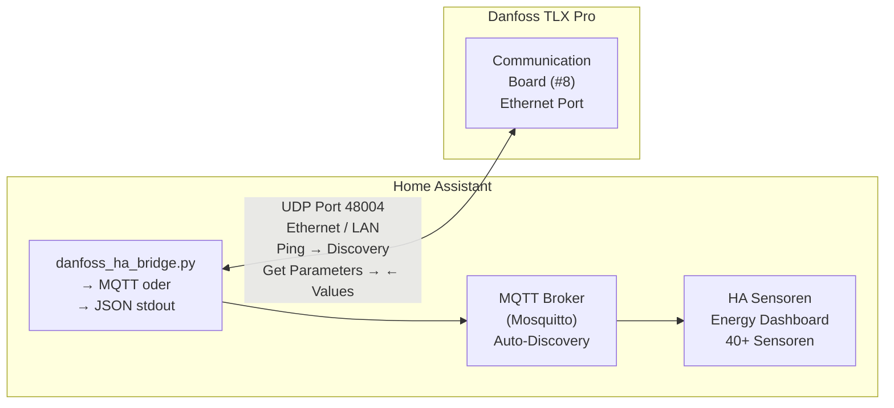

# Danfoss TLX Pro → Home Assistant (EtherLynx/UDP)

[](https://github.com/hacs/integration)
[](https://my.home-assistant.io/redirect/hacs_repository/?owner=volschin&repository=Danfoss-TLX-2-HA&category=integration)
[](https://github.com/volschin/Danfoss-TLX-2-HA/releases)
[](LICENSE)

Direkte Anbindung des Danfoss TLX Pro Wechselrichters an Home Assistant
über das **EtherLynx-Protokoll** (UDP Port 48004) – ohne zusätzliche
Hardware wie ESP32 oder RS485-Adapter.

## Architektur



## Voraussetzungen

- **Danfoss TLX Pro** mit Ethernet-Anschluss (RJ45)
- **Ethernet-Kabel** vom Inverter zum LAN/Switch
- **Python 3.9+** auf dem HA-Host
- **paho-mqtt** (nur für MQTT-Modus): `pip install paho-mqtt`
- **Kein** ESP32, RS485-Adapter oder sonstige Hardware!

## Dateien

|Datei                      |Beschreibung                            |
|---------------------------|----------------------------------------|
|`danfoss_etherlynx.py`     |Protokoll-Bibliothek (EtherLynx UDP)    |
|`danfoss_ha_bridge.py`     |HA-Bridge (MQTT-Daemon oder JSON-Modus) |
|`danfoss_config.yaml`      |Konfigurationsdatei                     |
|`configuration.yaml`       |HA Sensor- und Automations-Konfiguration|
|`danfoss_etherlynx.service`|systemd-Service für den MQTT-Daemon     |

## Schnellstart

### 1. Dateien kopieren

```bash
# Auf dem Home Assistant Host:
mkdir -p /config/scripts
cp danfoss_etherlynx.py /config/scripts/
cp danfoss_ha_bridge.py /config/scripts/
cp danfoss_config.yaml  /config/scripts/
```

### 2. IP-Adresse anpassen

Öffne `danfoss_config.yaml` und trage die IP-Adresse deines
Inverters ein:

```yaml
inverter_ip: "192.168.1.100"   # ← anpassen!
pv_strings: 2                   # 2 oder 3
```

### 3. Schnelltest

```bash
# Discovery-Test: Ist der Inverter erreichbar?
python3 /config/scripts/danfoss_etherlynx.py 192.168.1.100 --mode discover

# Alle Parameter als JSON lesen:
python3 /config/scripts/danfoss_etherlynx.py 192.168.1.100 --mode all -v
```

### 4a. Variante A: MQTT (empfohlen)

```bash
# paho-mqtt installieren
pip install paho-mqtt

# Daemon starten (Test)
python3 /config/scripts/danfoss_ha_bridge.py \
  --mode mqtt \
  --config /config/scripts/danfoss_config.yaml

# Als Service installieren
sudo cp danfoss_etherlynx.service /etc/systemd/system/
sudo systemctl daemon-reload
sudo systemctl enable --now danfoss_etherlynx
```

→ Sensoren erscheinen automatisch in HA unter “Danfoss TLX Pro”.

### 4b. Variante B: Command-Line-Sensoren

Füge den Inhalt von `configuration.yaml` in deine HA-Konfiguration ein.
Kein MQTT nötig, aber weniger elegant.

## Verfügbare Sensoren (40+)

### Echtzeit (alle 15–30 Sekunden)

- Netzleistung gesamt + pro Phase (W)
- PV-Spannung, Strom, Leistung pro String
- Netzspannung pro Phase (V)
- Netzstrom pro Phase (A)
- Netzfrequenz (Hz)
- Betriebsmodus

### Energie (alle 5 Minuten)

- Gesamtproduktion (Wh, Lifetime)
- Produktion heute (Wh)
- Netzenergie heute pro Phase
- PV-Energie pro String
- Wochenproduktion, Monatsproduktion, Jahresproduktion

### System (stündlich)

- Hardware-Typ, Nennleistung
- Software-Version
- Seriennummer

### Berechnet (Templates)

- DC-Gesamtleistung
- Wirkungsgrad (%)
- Online-Status

## Protokoll-Details

Das EtherLynx-Protokoll ist die Ethernet-Variante des ComLynx-Protokolls.
Basierend auf dem offiziellen Danfoss User Guide:

- **Transport:** UDP, Port 48004
- **Adressierung:** Seriennummer des Inverters
- **Nachrichtentypen:** Ping (0x01), Get/Set Parameter (0x02), Get/Set Text (0x03)
- **Parameter-Zugriff:** Index/Subindex, Module ID 8 (Communication Board)
- **Byte-Order:** Header-Felder Big-Endian, Parameterwerte Big-Endian rechts-aligniert im 4-Byte-Feld, Payload num_params Little-Endian
- **Mehrere Parameter pro Request** möglich (Batch-Abfrage)

## Troubleshooting

### “Inverter nicht erreichbar”

1. Inverter muss **eingeschaltet** sein (nur bei Tageslicht/Solarproduktion aktiv)
1. Ethernet-Kabel prüfen (Link-LED am Inverter und Switch)
1. IP-Adresse korrekt? Prüfe im Router/DHCP
1. Ping-Test: `ping 192.168.1.100`
1. UDP-Port nicht durch Firewall blockiert: `nc -u 192.168.1.100 48004`

### Nachts keine Daten

Das ist normal! Der TLX Pro schaltet sich nachts ab. Das Script erkennt
dies und setzt den Status auf “offline”. Morgens werden die Daten
automatisch wieder aktualisiert.

### Falsche Werte

- Prüfe die Skalierungsfaktoren in `danfoss_etherlynx.py`
- Manche Parameter sind erst ab bestimmten Firmware-Versionen verfügbar
- String 3 ist nur bei TLX 10k/12.5k/15k vorhanden

### MQTT Discovery funktioniert nicht

1. Mosquitto-Broker installiert und läuft?
1. MQTT-Integration in HA aktiviert?
1. Discovery-Prefix korrekt? (default: `homeassistant`)
1. Logs prüfen: `sudo journalctl -u danfoss_etherlynx -f`

## Fehleranalyse und Diagnose

### Diagnose-Kommandos

```bash
# Discovery-Test: Ist der Inverter erreichbar?
python3 danfoss_etherlynx.py 192.168.1.100 --mode discover

# Alle Parameter lesen (mit Debug-Ausgabe):
python3 danfoss_etherlynx.py 192.168.1.100 --mode all -v
```

### Seriennummer erkannt, aber keine Daten

Wenn der Discovery (Ping) funktioniert, aber `--mode all` keine Parameterwerte
liefert, kann das folgende Ursachen haben:

- **Firmware-Unterschiede:** Verschiedene TLX-Pro-Firmwareversionen können
  leicht abweichende Protokoll-Details haben.
- **Gerätetyp:** TLX 6k/8k/10k/12.5k/15k können unterschiedliche Parameter
  unterstützen.
- **Protokoll-Timing:** Manche Inverter brauchen längere Timeouts.

### Gerätetyp-Unterschiede

Der TLX Pro ist in verschiedenen Leistungsklassen verfügbar (6k bis 15k).
Nicht alle Modelle unterstützen identische Parameter. Insbesondere:

- **PV-String 3** ist nur bei TLX 10k/12.5k/15k vorhanden
- **Sentinel-Werte:** Temperatursensoren liefern 127°C wenn kein physischer
  Sensor angeschlossen ist — dieser Wert wird als "kein Sensor" interpretiert

### E2E-Test ausführen

Für die Diagnose mit einem echten Inverter steht ein End-to-End-Test bereit:

```bash
INVERTER_IP=192.168.1.100 python -m pytest tests/test_e2e_inverter.py -v -s
```

Dieser Test prüft Discovery, Parameter-Lesen und Wertebereiche gegen einen
echten Inverter und hilft bei der Fehlereingrenzung.

## Vergleich: EtherLynx vs. RS485/ESP32

|                         |EtherLynx (diese Lösung)|RS485 + ESP32          |
|-------------------------|------------------------|-----------------------|
|**Zusätzliche Hardware** |Keine (0 €)             |ESP32 + RS485 (~25 €)  |
|**Installation**         |Python-Script kopieren  |Firmware flashen, löten|
|**Wartung**              |Minimal                 |ESP32 kann abstürzen   |
|**Parameter pro Request**|N gleichzeitig          |Sequentiell            |
|**Datenrate**            |100 Mbit Ethernet       |19200 Baud RS485       |
|**Multi-Inverter**       |Broadcast möglich       |Nur 1:1                |
|**Schreibzugriff**       |Ja (Set Parameter)      |Nur lesen              |
|**Community-Support**    |Dieses Projekt          |Mehrere Projekte       |

## Lizenz

MIT License. Nutzung auf eigene Gefahr.
Das EtherLynx-Protokoll ist dokumentiert im offiziellen Danfoss
“ComLynx and EtherLynx User Guide”.
